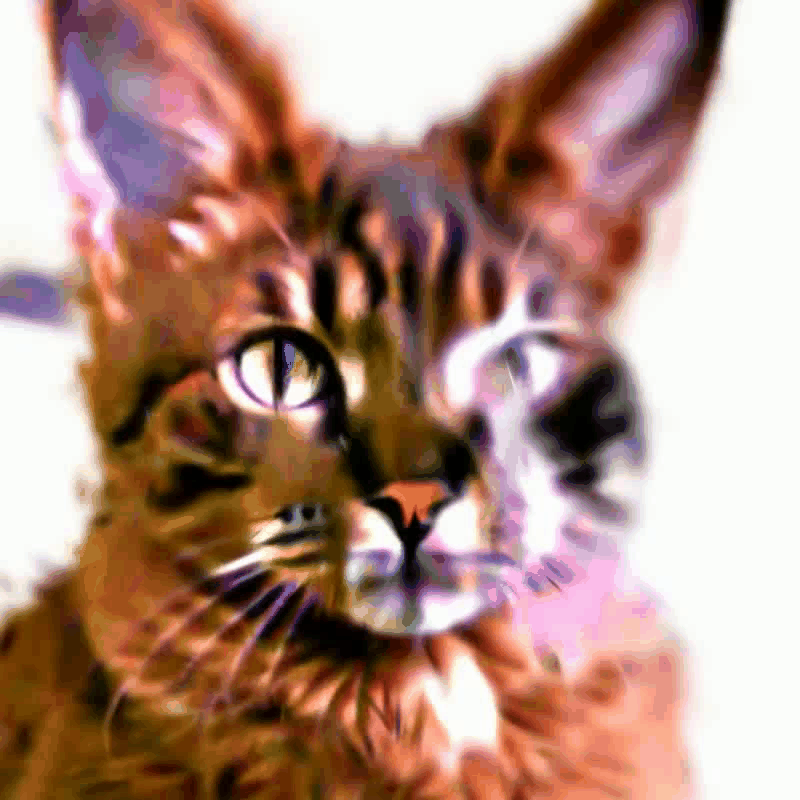

# Anamorphic Objects

This repository contains the extension of [DreamGaussian](https://github.com/dreamgaussian/dreamgaussian) to generate anamorphic objects. 

Anamorphic objects are a special type of 3D object that look different from different viewing angle. For example, this is an anamorphic object that looks like a cat when observed from the front, and looks like a dog when observed from the right. 



## Install
Please refer to the install instruction of [DreamGaussian](https://github.com/dreamgaussian/dreamgaussian).

## Usage
First, please modify the configuration file in config/text.yaml.
+ Prompt: the overall description of the object.
+ {directions}_prompt: description of the observation of the object from certain viewing direction.

Then, run the generation script to generate the object and the visualization video.
```bash
bash generate_sds.sh
```


## Acknowledgement
This project is majorly based on [DreamGaussian](https://github.com/dreamgaussian/dreamgaussian). Thanks for the awesome work. 
